# RECRUIT WEBSITE
## Team  Members:
```bash
Saigon University ,Faculty of Information Technology ,Major in Software Engineering
ID          | Full Name
3120410278    Nguyen Thanh Quynh Linh
3120410316    Quan Van Manh
3120410300    Doan Thanh Loi
3120410495    Pham Thanh Thien
```
## Project Description:
The website was built for employers and candidates to access with the purpose of finding suitable jobs
## Tech Stack Used:
```bash
    * React
    * Scss
    * Redux Toolkit
    * Node JS
    ---------------
    * Material UI
    * Font Awesome
    * TippyJs
```
## Website Functions:
```bash
   Candidate
    - Search jobs by many criteria (by salary, by name, address,occupation, according to personal profile)
    - Edit personal information
    - View details of job postings
    - Quick application
    - Display jobs according to candidate information
    Employer:
    - Create, edit and delete job postings
    - CV management: can view CVs, confirm or reject candidates with notification send mail
    - Edit personal and company information
```
## [Project Demo Link]([https://www.youtube.com/watch?v=20o8wvX0VQw](https://youtu.be/2TR-u_WX7tU?si=1MO8wxxKaDUzIFDO))
## Some features of the site:
Home Page                   |                   Home request
:---------------------------------:        |      :------------------------------:
  | 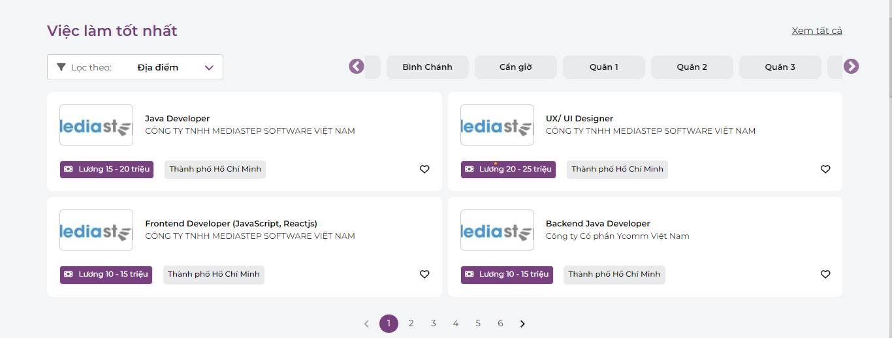

Home Page                   |                   Home Page
:---------------------------------:        |      :------------------------------:
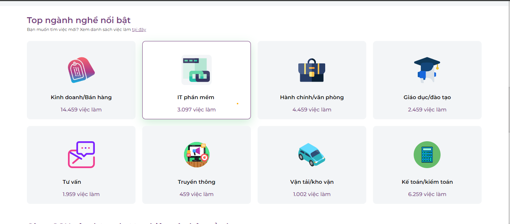  | 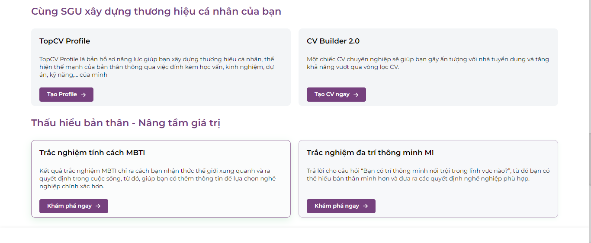

Login Page                   |                   Register Page
:---------------------------------:        |      :------------------------------:
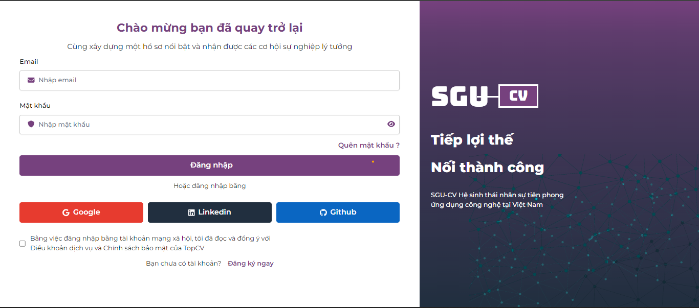  | 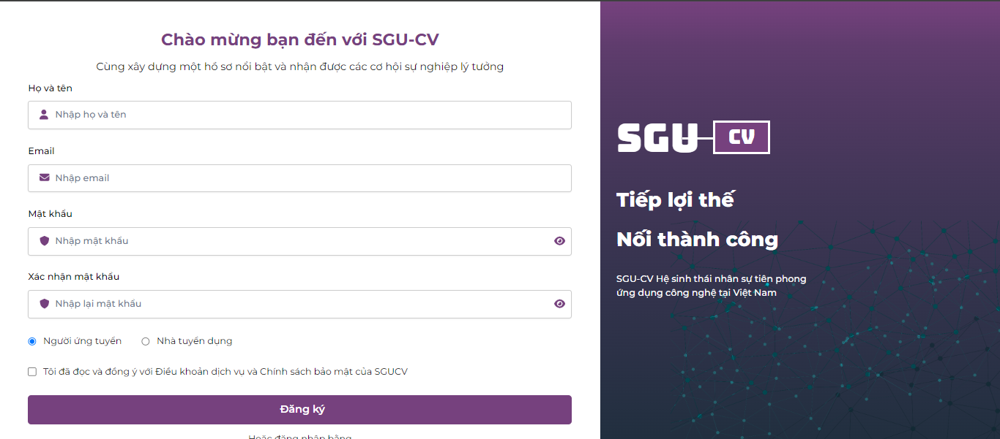

LatestJobs Page                   |                   DetailJobs Page
:---------------------------------:        |      :------------------------------:
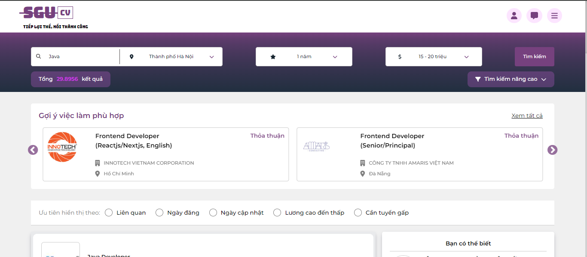  | 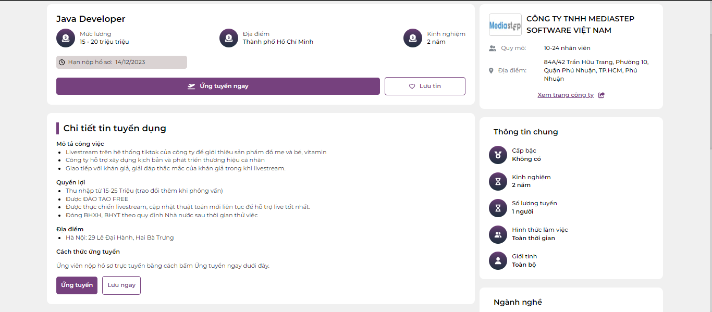

ApplyJob Page                   |                   Settings
:---------------------------------:        |      :------------------------------:
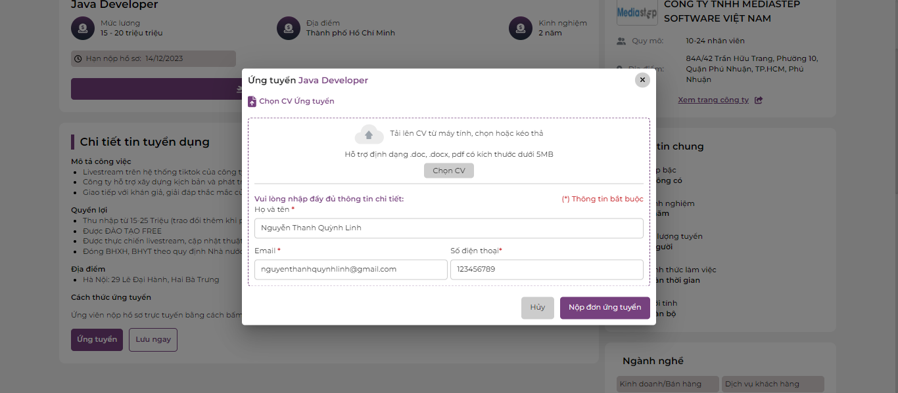  | 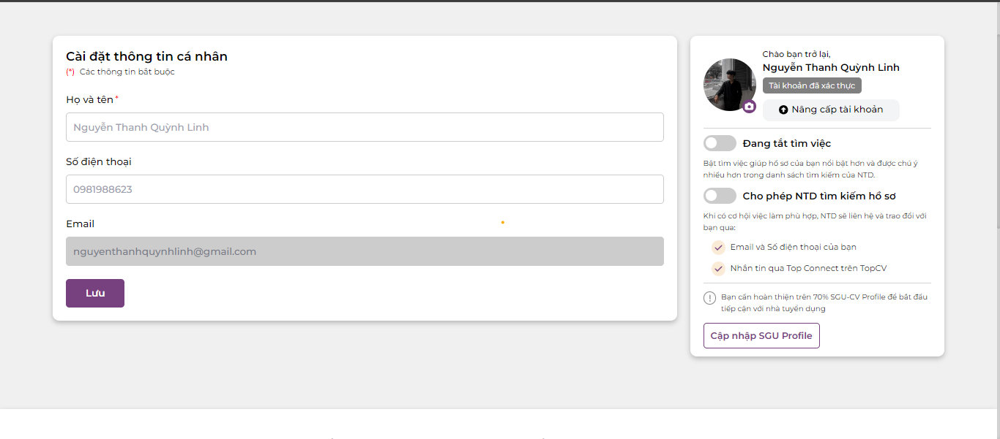

Profile Page                   |                   Dashboard Page
:---------------------------------:        |      :------------------------------:
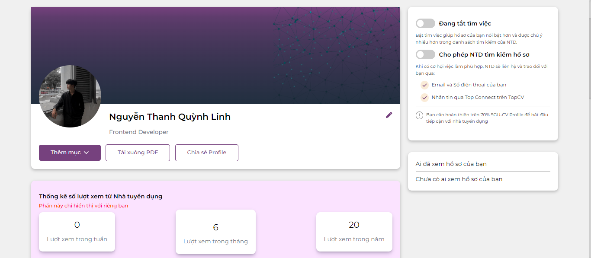  | 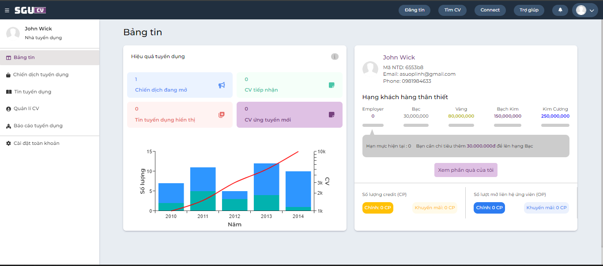

RecruitmentCampaigns Page                   |                   NewJob Page
:---------------------------------:        |      :------------------------------:
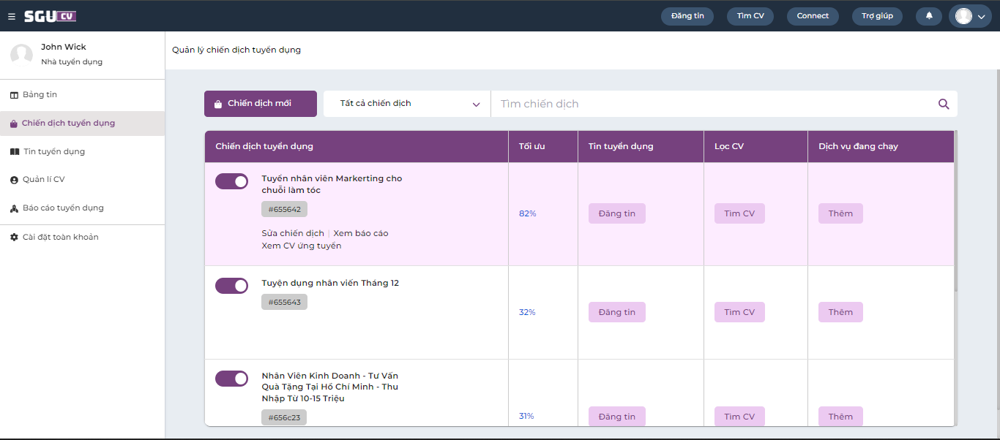  | 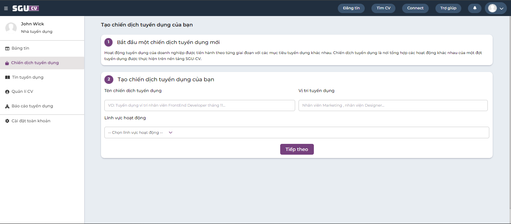

RecruitmentCampaigns Page                   |                   ManageCv Page
:---------------------------------:        |      :------------------------------:
  | 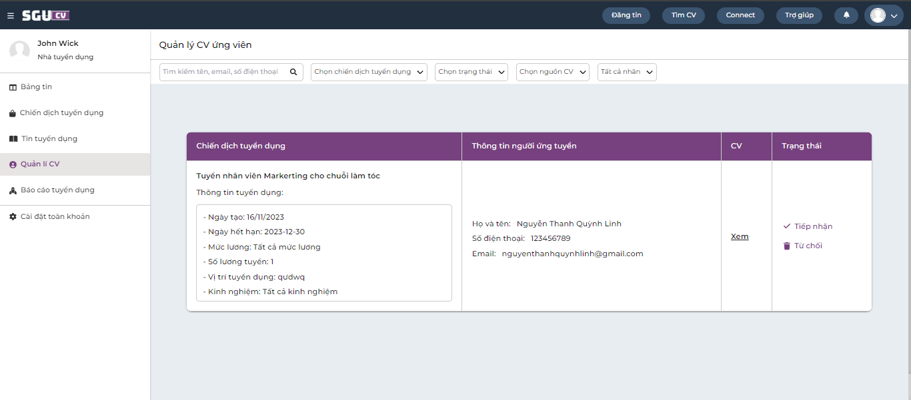

### Make sure to star the repository if you find it helpful!
### The interface website is designed according to TopCv!
<a href="https://github.com/ThanhLoi-300/recruit_website/stargazers"></a>